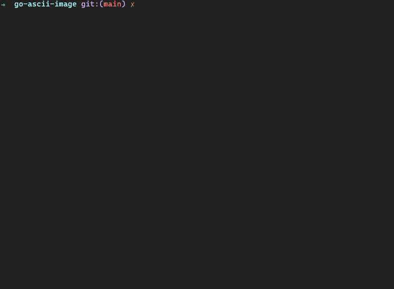

# go-ascii-image
A simple CLI image converter to ASCII

## Usage

```
./go-ascii-image -p abc.jpg -w 80

-p path of your picture
-w the width of output
```

## Installation

```
go get github.com/LeandroLS/go-ascii-image
```

## Example

